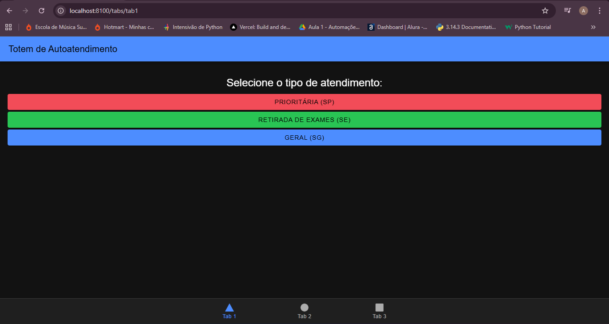
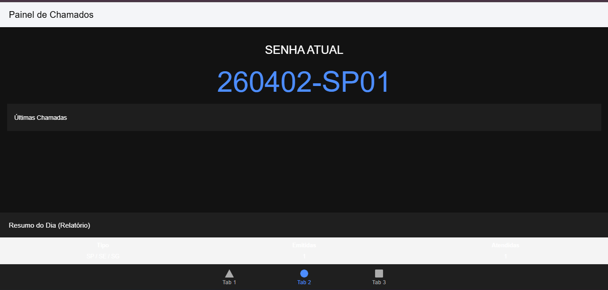
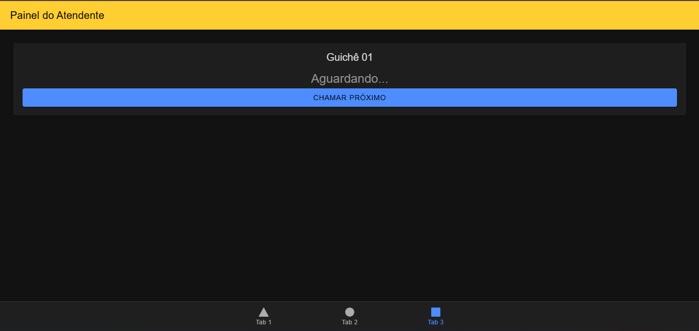

# MobileTicketsIonic 🏥

Sistema mobile para gestão de filas e tickets de atendimento laboratorial, desenvolvido com **Ionic Framework** e **Angular**. O projeto simula o fluxo completo desde a emissão da senha até a chamada no guichê, respeitando regras rigorosas de priorização.

## 📋 Requisitos do Projeto (Baseado no PDF)
O sistema foi construído para atender às seguintes especificações técnicas e de negócio:
- **Identificador de Senha:** Formato `YYMMDD-PPSQ` (Ex: 260402-SP01).
- **Categorias:** Prioritária (SP), Geral (SG) e Exames (SE).
- **Regra de Chamada:** Alternância entre Prioritária e demais tipos ($[SP] \to [SE|SG] \to [SP]$).
- **Horário de Expediente:** Emissão permitida apenas das 07:00 às 17:00.
- **Taxa de Desistência:** Simulação de 5% de não comparecimento (descarte de senha).

## 📸 Demonstração
Aqui estão as telas principais do sistema:

### 1. Totem de Autoatendimento (Tab 1)
Interface utilizada pelo cliente para selecionar o tipo de serviço e gerar o ticket.


### 2. Painel de Chamadas (Tab 2)
Exibição em tempo real da senha atual e histórico das últimas 5 chamadas, incluindo indicadores de desempenho (KPIs).


### 3. Console do Atendente (Tab 3)
Interface para os funcionários chamarem o próximo cliente seguindo a lógica de priorização automática.


## 🛠️ Tecnologias Utilizadas
- **Framework:** [Ionic v7+](https://ionicframework.com/)
- **Lógica:** [Angular v17+](https://angular.io/) (Standalone Components)
- **Linguagem:** TypeScript
- **Integração:** Capacitor (Pronto para Android/iOS)

## 🚀 Como Executar
1. Instale as dependências:
   ```bash
   npm install